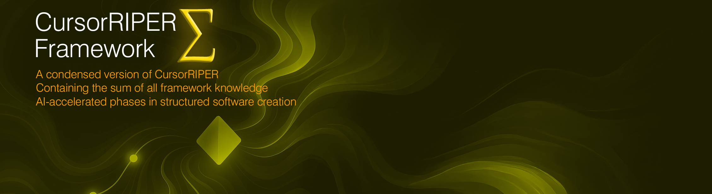

# CursorRIPER♦Σ (Sigma)

[](https://opensource.org/licenses/MIT)


## 🏛️[New Wiki Documents](https://github.com/johnpeterman72/CursorRIPER.sigma/wiki)

> A symbolic, ultra-efficient AI prompt framework for software development assistance with code protection, context reference, permission management, MCP service integrations, and enterprise BMAD-Method capabilities.

Current version: [ripersigma105.mdc](.cursor/rules/ripersigma105.mdc) - fixed* the issues with the rules not loading due to the file name having uppercase letters in their name.

Try out [cursorriper.sigma-lite](https://github.com/johnpeterman72/cursorriper.sigma-lite), a Lite version without context references, permissions, or code protection.

## 📚 Overview

CursorRIPER♦Σ is a highly optimized, symbolic implementation of the [CursorRIPER framework](https://github.com/johnpeterman72/cursorriper) designed to enhance AI-assisted software development. It utilizes a symbolic notation system that incorporates mathematical operators, emojis, and Greek letters to compress complex development workflows into a compact yet comprehensive token footprint.

The framework reduces ~15,000 words of instructions to under 1,000 while preserving full functionality, making it dramatically more efficient for AI token usage. The idea came from [Tof](https://forum.cursor.com/t/user-rules-with-memory-errors-tracking-rules-generation/68321)

## 🌟 Key Features

### Core Framework
- **Symbolic Notation**: Uses Greek letters (Ω, Π, Σ, Δ, Γ, ℙ), subscripts, and emoji for extreme conciseness
- **RIPER Workflow Modes**: Research, Innovate, Plan, Execute, Review (🔍R, 💡I, 📝P, ⚙️E, 🔎RV)
- **Structured Memory System**: Standardized file templates with cross-referencing
- **Phase-based Project Management**: Tracks project progress from initialization to maintenance
- **Automatic Memory**: Creates and maintains a structured memory bank for project context
- **Code Protection System**: Protects critical code sections with intelligent comment annotations
- **Context Reference System**: Manages and tracks file, code, and document references
- **Permission System**: Enforces mode-specific CRUD operations and handles violations

### MCP Service Integrations (Optional)
- **GitHub Integration (Θ)**: Repository management, PRs, issues, branches
- **Web Search (Λ)**: Brave Search API for research (blocked in EXECUTE mode!)
- **Browser Automation (Υ)**: Puppeteer/Playwright for testing and scraping
- **Docker Integration (Ξ)**: Container and compose management

### BMAD Enterprise Features (Optional)
- **Role System (Β)**: Product Owner, Architect, Developer, QA, DevOps roles
- **PRD Management (Ρ)**: Transform from memory-bank to PRD-driven development
- **Quality Gates (Κ)**: Sequential approval workflow with checklists
- **Enterprise Features (Ε)**: Documentation generation, versioning, compliance, audit

## 🧠 Framework Structure

### Modes (Ω)

```
Ω₁ = 🔍R ⟶ ℙ(Ω₁) ⟶ Research: Gather information and document findings
Ω₂ = 💡I ⟶ ℙ(Ω₂) ⟶ Innovate: Explore options and suggest ideas
Ω₃ = 📝P ⟶ ℙ(Ω₃) ⟶ Plan: Create specifications and sequence steps
Ω₄ = ⚙️E ⟶ ℙ(Ω₄) ⟶ Execute: Implement code according to plan
Ω₅ = 🔎RV ⟶ ℙ(Ω₅) ⟶ Review: Validate output against requirements
```

### Phases (Π)

```
Π₁ = 🌱UNINITIATED ⟶ Framework installed but not started
Π₂ = 🚧INITIALIZING ⟶ Setup in progress
Π₃ = 🏗️DEVELOPMENT ⟶ Main development work
Π₄ = 🔧MAINTENANCE ⟶ Long-term support
```

### Memory Files (σ)

```
σ₁ = 📋projectbrief.md ⟶ Requirements, scope, criteria
σ₂ = 🏛️systemPatterns.md ⟶ Architecture, components, decisions
σ₃ = 💻techContext.md ⟶ Stack, environment, dependencies
σ₄ = 🔮activeContext.md ⟶ Focus, changes, next steps, context references
σ₅ = 📊progress.md ⟶ Status, milestones, issues
σ₆ = 🛡️protection.md ⟶ Protected regions, history, approvals, violations
```

### Protection Levels (Ψ)

```
Ψ₁ = PROTECTED ⟶ Highest protection, do not modify
Ψ₂ = GUARDED ⟶ Ask before modifying
Ψ₃ = INFO ⟶ Context note
Ψ₄ = DEBUG ⟶ Debugging code
Ψ₅ = TEST ⟶ Testing code
Ψ₆ = CRITICAL ⟶ Business logic, highest protection
```

### Context References (Γ)

```
Γ₁ = 📄 @Files ⟶ File references
Γ₂ = 📁 @Folders ⟶ Folder references
Γ₃ = 💻 @Code ⟶ Code references
Γ₄ = 📚 @Docs ⟶ Documentation references
Γ₅ = 📏 @Rules ⟶ Cursor rules references
Γ₆ = 🔄 @Git ⟶ Git history references
Γ₇ = 📝 @Notepads ⟶ Notepad references
Γ₈ = 📌 #Files ⟶ Pinned file references
```

### Permission Matrix (ℙ)

```
ℙ = {C: create, R: read, U: update, D: delete}

ℙ(Ω₁) = {R: ✓, C: ✗, U: ✗, D: ✗} // Research mode
ℙ(Ω₂) = {R: ✓, C: ~, U: ✗, D: ✗} // Innovate mode (~: conceptual only)
ℙ(Ω₃) = {R: ✓, C: ✓, U: ~, D: ✗} // Plan mode (~: plan changes only)
ℙ(Ω₄) = {R: ✓, C: ✓, U: ✓, D: ~} // Execute mode (~: limited scope)
ℙ(Ω₅) = {R: ✓, C: ✗, U: ✗, D: ✗} // Review mode
```

## 🚀 Getting Started

### Quick Start (Core Framework Only)

1. Create a memory bank directory in your project:

```bash
mkdir -p /memory-bank/backups
```

2. Copy the CursorRIPER♦Σ framework `.mdc` files to your project rules folder: `.cursor/rules/`

3. Initialize the framework with the AI assistant:

```
/start
```

### Optional: Enable MCP Services

See the [Quick Start Guide](./docs/quickstart.md) for instructions on enabling GitHub, Web Search, Browser Automation, and Docker integrations.

### Optional: Enable BMAD Enterprise

Refer to the [BMAD Integration Guide](./docs/bmad_integration_guide.md) for guidance on adopting enterprise features, including roles, PRDs, and quality gates.

### Usage

Change modes by using the following commands with your AI assistant:

```
/research (or /r) - Research mode
/innovate (or /i) - Innovate mode
/plan (or /p) - Plan mode
/execute (or /e) - Execute mode
/review (or /rev) - Review mode
```

## 📑 Memory System

The framework automatically maintains six key memory files:

1. **Project Brief** (σ₁): Defines requirements, success criteria, and scope
2. **System Patterns** (σ₂): Captures architecture, components, and design decisions
3. **Technical Context** (σ₃): Records technology stack, environment, and dependencies
4. **Active Context** (σ₄): Tracks current focus, recent changes, next steps, and context references
5. **Progress Tracker** (σ₅): Monitors project status, features, issues, and milestones
6. **Protection Registry** (σ₆): Tracks protected code regions, history, approvals, and permission violations

## 🛡️ Code Protection System

The framework includes a robust code protection system that helps preserve critical code sections from unintended modifications:

### Protection Levels

- **PROTECTED**: Code that must not be modified under any circumstances
- **GUARDED**: Code that requires explicit permission before modification
- **INFO**: Context information relevant to understanding code
- **DEBUG**: Temporary code used for debugging purposes
- **TEST**: Code related to testing functionality
- **CRITICAL**: Business logic that must be treated with extreme care

### Protection Commands

Add code protection with shorthand commands:

```
!cp - Add PROTECTED comment
!cg - Add GUARDED comment
!ci - Add INFO comment
!cd - Add DEBUG comment
!ct - Add TEST comment
!cc - Add CRITICAL comment
```

See [Protection Commands](./docs/ProtectionCommands.md) for complete documentation.

## 📎 Context Reference System

The context reference system allows tracking and managing important files, code, and documents:

### Context Types

- **@Files**: Important files in the project
- **@Folders**: Relevant directories or folder structures
- **@Code**: Code sections, functions, or classes
- **@Docs**: Documentation or specification references
- **@Rules**: Cursor project rules references
- **@Git**: Git history or commit references
- **@Notepads**: Notepad content references
- **#Files**: Pinned file references

### Context Commands

Manage context references with shorthand commands:

```
!af - Add file reference
!ad - Add directory reference
!ac - Add code reference
!adoc - Add documentation reference
!ar - Add rules reference
!ag - Add git reference
!an - Add notepad reference
!pf - Pin file to context
```

See [Context Usage Guide](./docs/howto_context.md) for more details.

## 🔐 Permission System

The permission system enforces appropriate operations for each mode and handles violations:

### Permission Matrix

Each mode has a specific set of allowed CRUD operations:
- **Research Mode**: Read only
- **Innovate Mode**: Read and conceptual creation
- **Plan Mode**: Read, create, and plan updates
- **Execute Mode**: Read, create, update, and limited deletion
- **Review Mode**: Read only

### Permission Commands

Check and verify permissions with shorthand commands:

```
!ckp - Check permissions for current mode
!pm - Check if operation is permitted
!sp - Show permissions for specified mode
!vm - Verify mode appropriate for operation
```

See [Permission Reference](./docs/permission_reference.md) for quick reference.

## ⚠️ Safety Features

- Automatic backups before destructive operations
- Confirmation prompts for critical actions
- Phase transition verification
- Error recovery suggestions
- Code protection system with mode-aware behavior
- Permission violation detection and recovery
- Context tracking with status indicators

## 🔣 Symbol Reference

See the [Symbol Reference Guide](./docs/symbol-reference-guide.md) (v3.0) for a complete list of symbols and notation used in the framework, including:
- Core framework symbols (Ω, Π, Σ, Ψ, Γ, ℙ)
- MCP service symbols (Θ, Λ, Υ, Ξ)
- BMAD enterprise symbols (Β, Ρ, Κ, Ε)
- All command shortcuts and integrations

## 📋 Additional Resources

- [Quick Start Guide](./docs/quickstart.md) - Get started in 5 minutes
- [BMAD Integration Guide](./docs/bmad_integration_guide.md) - Enterprise adoption
- [Integration Tests](./docs/integration_tests.md) - Test scenarios and examples
- [MCP Setup Guides](./docs/mcp/) - Individual service setup instructions
- [Changelog](https://github.com/johnpeterman72/CursorRIPER.sigma/blob/main/docs/changelog.md) - Detailed version history

## 🤝 Contributing

Contributions are welcome! Please feel free to submit a Pull Request.

## 📄 License

This project is licensed under the MIT License - see the LICENSE file for details.

---

*CursorRIPER♦Σ: Symbolic efficiency for AI-assisted development with intelligent code protection, context awareness, and permission enforcement.*
