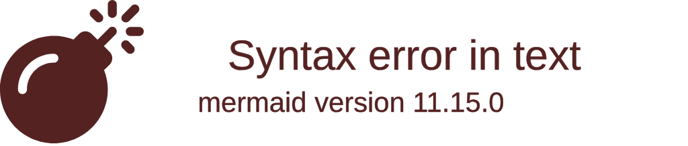

# σ₅: Progress Tracker
*v1.0 | Created: 2025-04-09 | Updated: 2025-04-09*
*Π: DEVELOPMENT | Ω: RESEARCH*

## 📈 Project Status
Completion: [X]%

```mermaid
pie
    title Project Completion
    "Completed" : [X]
    "In Progress" : [Y]
    "Not Started" : [Z]
```
## ✅ What Works

[Fâ‚] [✅] [Feature 1] - [Notes]
[F₂] [✅] [Feature 2] - [Notes]

## â³ What's In Progress

[F₃] [â³30%] [Feature 3] - [Notes] [↗ï¸Ïƒâ‚„₃]
[Fâ‚„] [â³60%] [Feature 4] - [Notes] [↗ï¸Ïƒâ‚„₃]

## 🔜 What's Left To Build

[Fâ‚…] [🔜] [HIGH] [Feature 5] - [Notes] [↗ï¸Ïƒâ‚„â‚]
[F₆] [🔜] [MED] [Feature 6] - [Notes] [↗ï¸Ïƒâ‚„â‚‚]

## âš ï¸ Known Issues

[Iâ‚] [âš ï¸] [HIGH] [Issue 1] - [Status]
[Iâ‚‚] [âš ï¸] [LOW] [Issue 2] - [Status]

## ğŸ Milestones

[Mâ‚] [2025-05-01] [â³] [Milestone 1]
[M₂] [2025-06-01] [🔜] [Milestone 2]

---
σ₅ tracks project progress and outstanding work
