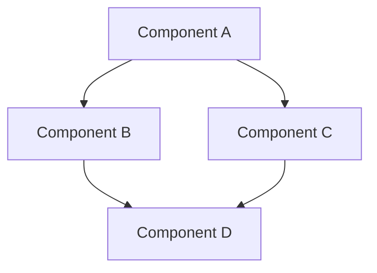

# σ₂: System Patterns
*v1.0 | Created: 2025-04-09 | Updated: 2025-04-09*
*Π: DEVELOPMENT | Ω: RESEARCH*

## 🏛️ Architecture Overview
[High-level system architecture description]


## 🧩 Key Components

[K₁] [Component 1]: [Purpose]
[K₂] [Component 2]: [Purpose]
[K₃] [Component 3]: [Purpose]

## 🧪 Design Patterns

[P₁] [Pattern 1]: [Usage context]
[P₂] [Pattern 2]: [Usage context]

## 🔄 Data Flow
[Data flow description]
```
flowchart LR
    User[User] --> FE[Frontend]
    FE --> API[API Layer]
    API --> DB[(Database)]
    API --> ES[External Services]
```
## 🔍 Technical Decisions

[D₁] [Decision 1]: [Rationale] [↗️σ₁₁]
[D₂] [Decision 2]: [Rationale] [↗️σ₁₂]

## 🔗 Component Relationships
[Component interaction description]
---
σ₂ captures system architecture and design patterns